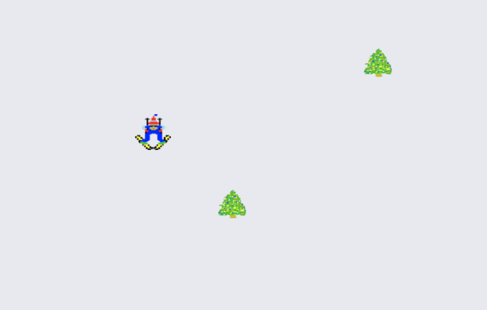

--
#[Ski Free ](https://noeljane.github.io/skifree/) 
--

###Description of the game:

In this 1991 Microsoft classic, you are a skier who is trying to avoid obstacles on the ski slope. 

 I am making a simpler version where the obstacles come toward the skier and the skier must move left or right at the right time to avoid the obstacle. 

 

####How to Play: 

Click start and move your skier left and right to avoid obstacles. After you crash, it is player 2's turn. 

The winner is the skier who has avoided obstacles for longer. 

[Click here to play!](https://noeljane.github.io/skifree/)

###Development and Technologies: 

 HTML, CSS, Javascript, and jQuery 

--

###User Stories

I want instructions on how to play on the first screen you see

I want to hit start to begin play

I want to control my skier using left and right arrows.

I want to be able to score based off how long I live.

I want to be able to compare my score with player 2.

I want to feel nostalgia for the past. 

--
####MVP:

- Skier has random objects coming near him 
- Objects randomly appear from the bottom of the screen
- When skier hits object, his gameplay ends. 
- Player 2 can play and score is compared to player 1

--

####Dream features:
- A ogre comes at a certain point and tries to eat the skier
- Jumps/slalom appear for that count toward style points. 
- More obstacles like rocks and moguls appear. 
- Silly things like a snowboarder, child skier and ski lift also appear. 
- Be able to pause the game 

--
####credits
- Zeke Abuhoff
- [Skier image from Aidan Fray:](https://goo.gl/images/YL8UJN)
- [Tree image from here](https://goo.gl/images/3WBY6i)

--

